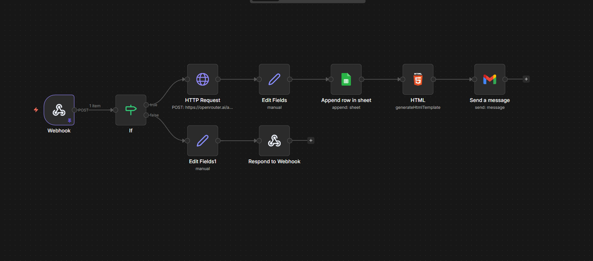

# 📚 AI Study Planner Generator

An AI-powered web application that generates a personalized study plan and sends it directly to the user’s email using workflow automation.

---

## 🚀 Project Overview

Students often struggle to create effective study schedules. This project automates the entire process by generating a structured study plan using AI.

The user provides:

* Email address
* Subject
* Exam date

The system:

* Generates a study plan using AI
* Stores the data
* Sends the plan via email

---

## 🧠 Features

* 🤖 AI-generated study plan
* 📩 Email delivery
* ⚙️ Automated workflow using n8n
* 🧾 Data storage using Google Sheets
* 🌐 Simple web interface
* ❌ No PDF generation (simplified system)

---

## 🛠️ Tech Stack

### Frontend

* HTML
* CSS
* JavaScript

### Backend / Automation

* n8n (workflow automation)
* Webhook API

### AI Integration

* OpenRouter / OpenAI API

### Database

* Google Sheets

---

## ⚙️ Workflow Explanation

1. User submits form from frontend
2. Request hits n8n webhook
3. Email is validated using IF node
4. If valid:

   * AI generates study plan
   * Data is stored in Google Sheets
   * HTML is generated
   * Email is sent to user
5. If invalid:

   * Error response is returned

---

## 🔁 Workflow Structure

Webhook → IF (Validation)

### True Path:

HTTP Request (AI)
→ Edit Fields
→ Google Sheets
→ HTML
→ Gmail (Send Email)

### False Path:

Edit Fields
→ Respond to Webhook (Error Message)

---

## 🌐 Live Demo

Frontend:
👉 https://vigneshm09.github.io/AI-STUDY-PLANNER/

Backend:
👉 Runs locally using n8n

---

## 📸 Project Screenshots

### Web Interface


### Workflow


---

## ▶️ How to Run

### 1. Start n8n

```bash
docker run -it -p 5678:5678 -v %USERPROFILE%\.n8n:/home/node/.n8n n8nio/n8n
```

---

### 2. Open n8n

http://localhost:5678

---

### 3. Activate Workflow

Turn ON the workflow

---

### 4. Open Website

Use GitHub Pages link and test

---

## 📌 Unique Points

* Combines AI + workflow automation
* No traditional backend coding required
* Uses n8n for automation pipeline
* Real-time email delivery system
* Input validation using conditional logic (IF node)

---

## ⚠️ Limitations

* Works only when n8n is running locally
* Requires internet for AI API and email

---

## 🔮 Future Improvements

* Auto-adjust study plan dynamically
* Add user login system
* Store user history in database
* Deploy backend to cloud

---

## 👨‍💻 Author

Vignesh M

📧 Email: [vignesh09102004@gmail.com](mailto:vignesh09102004@example.com)
